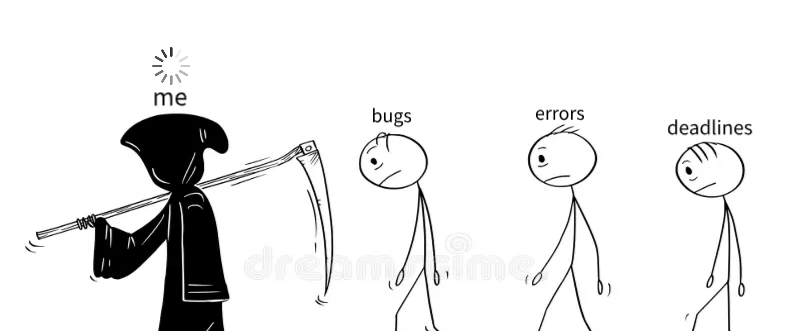

<!--    -->
 

## About Me 
<h6 align="center"> An introverted student who dwells in a nightmare filled with an urge to unveil every door of the afterlife never ends; instead of dying in dooms of hopelessness, savor the demons that live within. </h6> 

## Personal Information
- **Name:** Alexandra Acedo
- **Email:** amgacedo@gmail.com
- **Date of Birth:** August 7, 2002
- **MBTI:** INTP-J

## Education
- **Degree:** Bachelor of Science in Computer Science (Undergraduate)
- **Institution:** La Consolacion College Biñan
  
**Others:**
- CSU extended learning via IT Masters specializing in cybersecurity field.
- MTF Institute: Project Management

## Skills

## Achievements
- [Proficient in Web Fundamentals](https://drive.google.com/file/d/1Ekvy-Rd6f9-tLlbyXbe2hLcT2uWrmu8c/view?usp=sharing)

## Hobbies and Interests
- Sleeping 💤
- Listening To Music 🎧

## Motto
- **❝Disadvantages Over Advantages❞**

## 🍿 !notifs 

  

  
<!--
 
    
        --https://spotify-github-profile.kittinanx.com/api/view?uid=312vprgbiy5vh2vocqkmqv6jjlli&cover_image=false&theme=default&show_offline=true&background_color=121212&interchange=false
    https://spotify-github-profile.kittinanx.com/api/view?uid=312vprgbiy5vh2vocqkmqv6jjlli&redirect=true--
    
-->

    

    
  
   
  
   
    
  
  

  

## 📊 My Github Stats

 

## 🏆 GitHub Trophies

## ⛎ My Pet

 
<picture>
  <source media="(prefers-color-scheme: dark)" srcset="https://raw.githubusercontent.com/osiristape/osiristape/output/github-contribution-grid-snake-dark.svg">
  <source media="(prefers-color-scheme: light)" srcset="https://raw.githubusercontent.com/osiristape/osiristape/output/github-contribution-grid-snake.svg">
  
</picture>

## 💤

 

